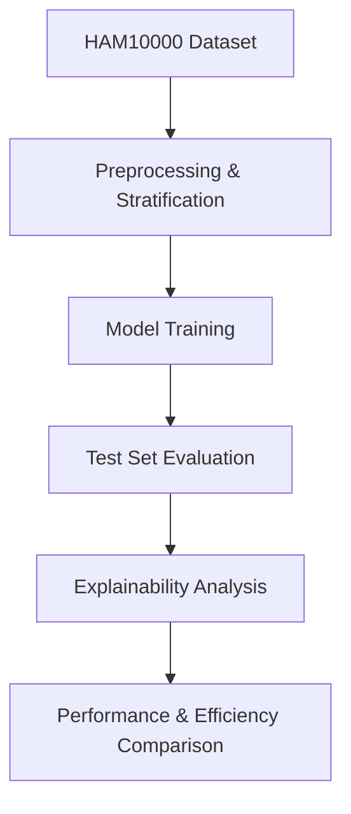
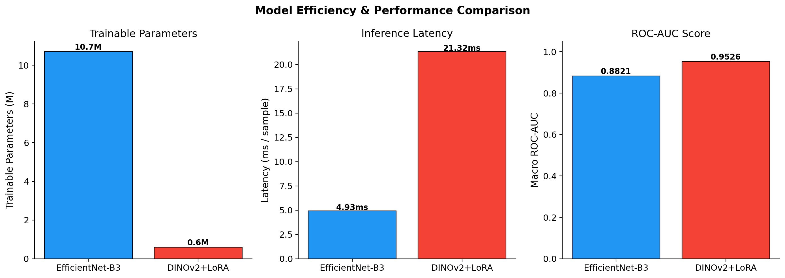
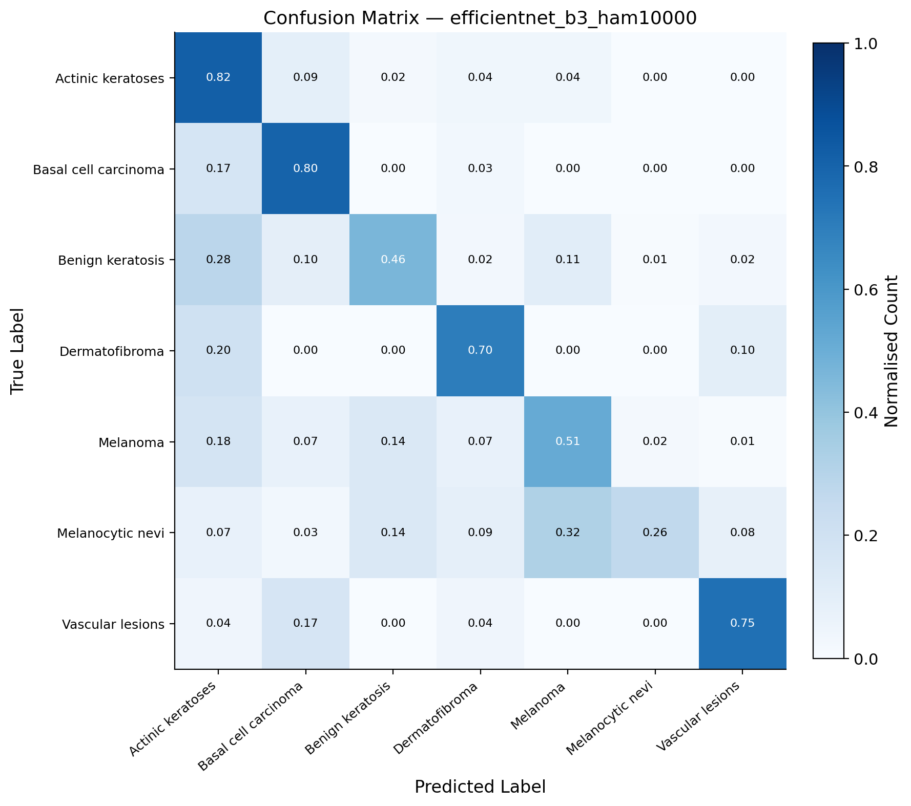
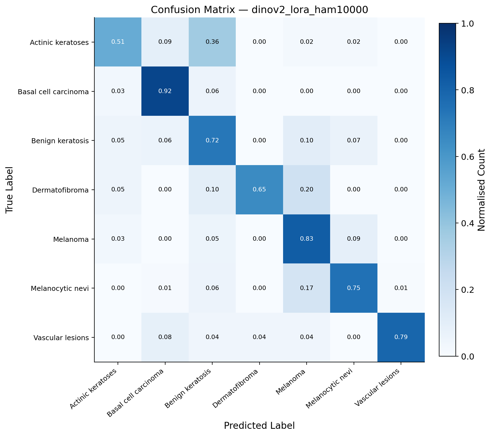
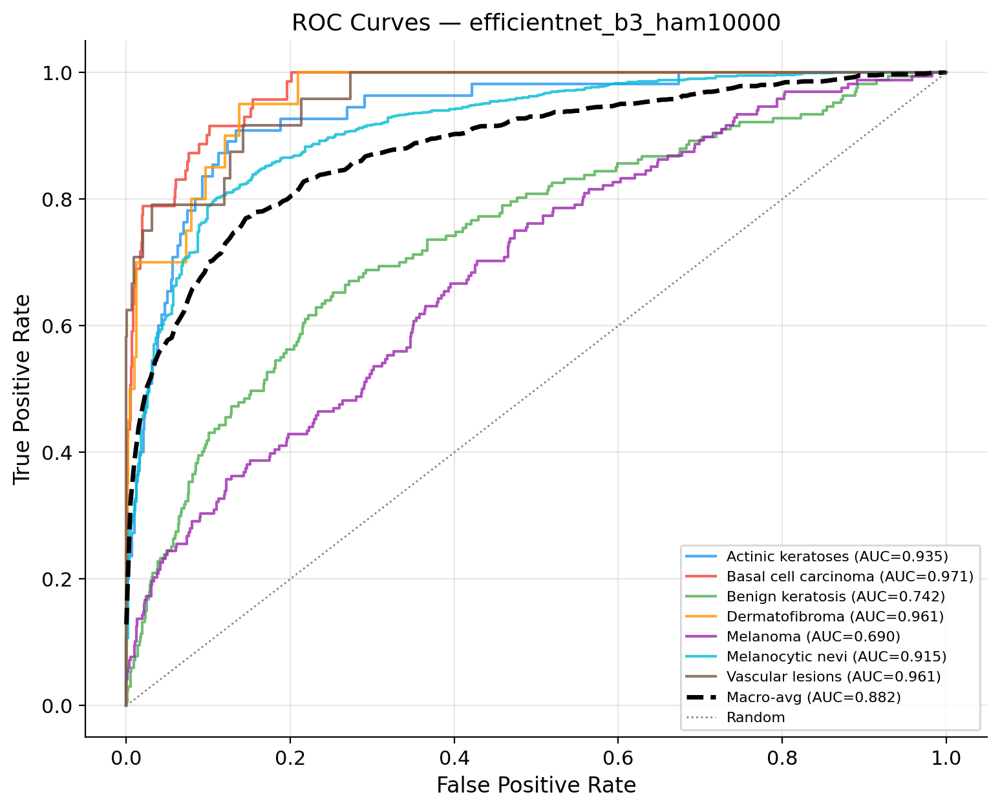
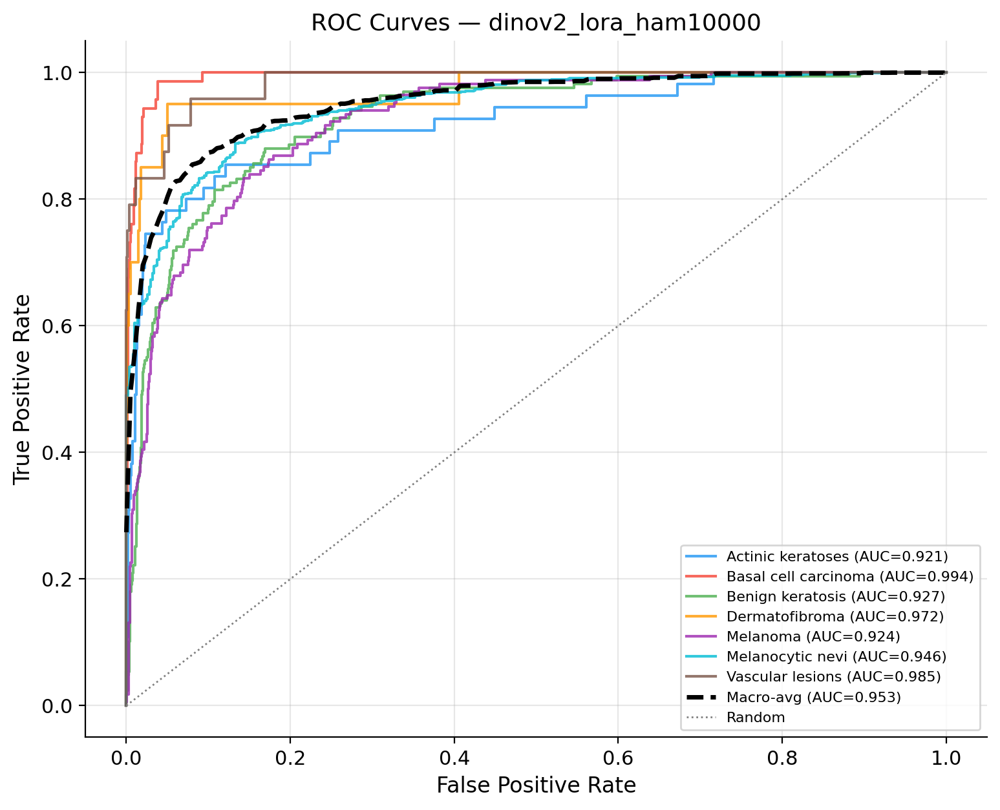
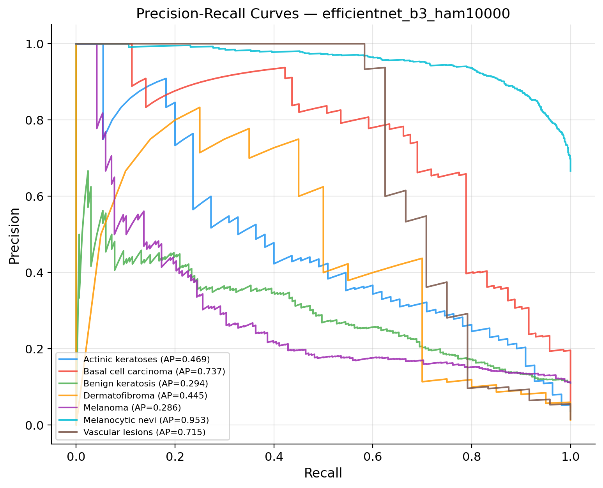
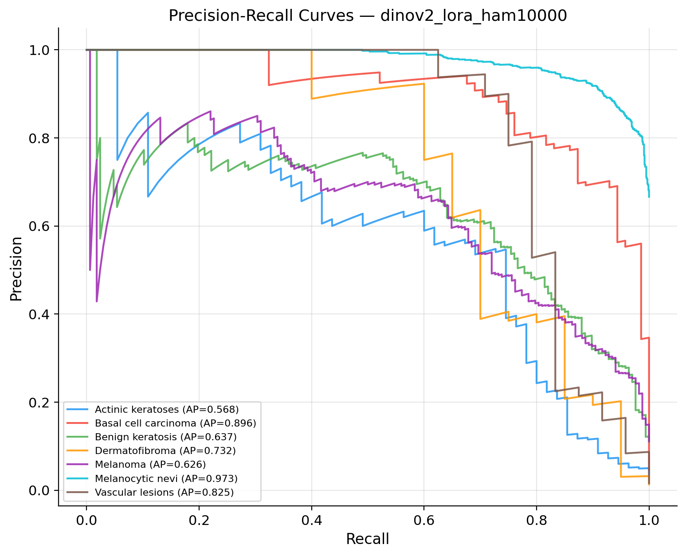
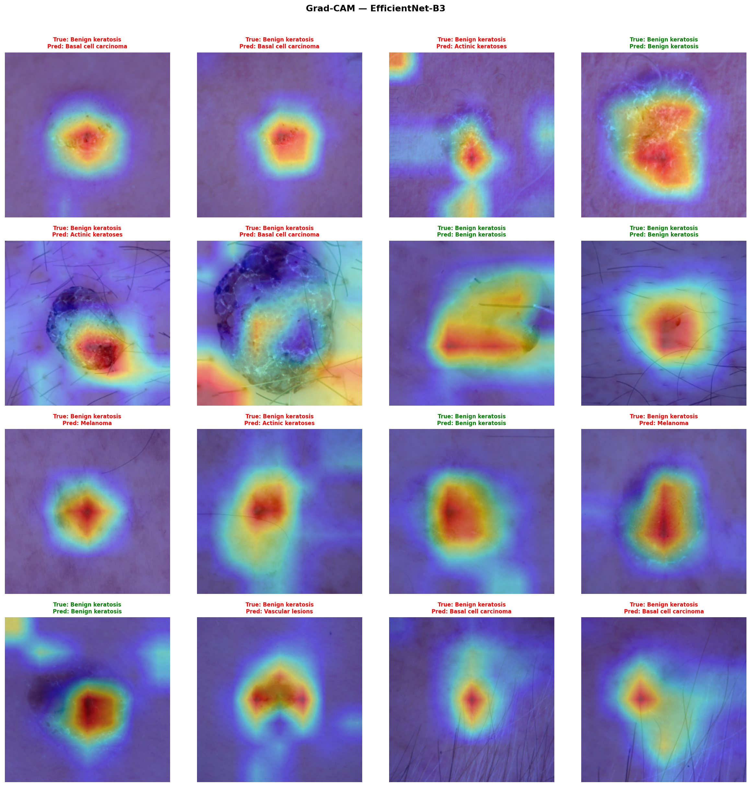
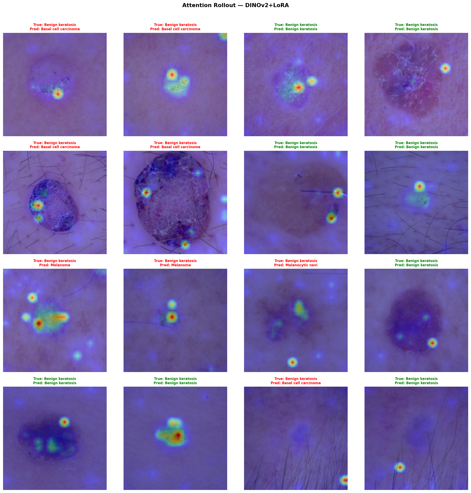

<div align="center">

# 🔬 Parameter-Efficient Fine-Tuning of Vision Foundation Models for Medical Image Analysis

[](https://python.org)
[](https://pytorch.org)
[](LICENSE)
[](https://black.readthedocs.io)
[](https://www.kaggle.com/code/adnanhassnain/medical-foundation-models)

</div>

---

## 📖 1. Overview

The medical imaging domain frequently suffers from data scarcity and high computational demands. While large Vision Foundation Models (VFMs) like DINOv2 exhibit remarkable transfer learning capabilities, performing full fine-tuning on them is computationally prohibitive and prone to overfitting in low-data regimes. This project explores **Parameter-Efficient Fine-Tuning (PEFT)** using Low-Rank Adaptation (LoRA) to adapt VFMs for skin lesion classification. Our main contribution is a comprehensive, reproducible analysis demonstrating that LoRA-adapted DINOv2 dramatically outperforms traditional CNN-based transfer learning while requiring significantly fewer trainable parameters, making advanced medical AI more accessible for clinical deployment.

## 🎯 2. Research Objective

**Can parameter-efficient fine-tuning (LoRA) applied to Vision Foundation Models achieve competitive skin lesion classification performance while requiring significantly fewer trainable parameters than traditional CNN-based transfer learning?**

## 🌟 3. Key Features

- **EfficientNet-B3 Baseline:** Traditional full fine-tuning of a powerful CNN architecture.
- **DINOv2 with LoRA:** State-of-the-art vision transformer adapted via Low-Rank Adaptation.
- **HAM10000 Dataset:** Extensive evaluation on a highly imbalanced real-world clinical dataset.
- **Explainable AI:** Grad-CAM (CNN) and Attention Rollout (ViT) for lesion localization.
- **Robust Training Pipeline:** Mixed Precision Training, Cosine Annealing, and Early Stopping.
- **Comprehensive Logging:** TensorBoard integration and reproducible experiments.
- **Performance Comparison:** Extensive metrics including ROC-AUC, F1, latency, and memory usage.
- **Publication-Quality Visualizations:** Auto-generated performance charts and explainability grids.

## 📊 4. Dataset

We utilize the **HAM10000** (Human Against Machine with 10000 training images) dataset.

- **Total Classes:** 7
- **Total Images:** 10,015
- **Class Distribution:**
  - Melanocytic nevi (`nv`): 66.9%
  - Melanoma (`mel`): 11.1%
  - Benign keratosis (`bkl`): 11.0%
  - Basal cell carcinoma (`bcc`): 5.1%
  - Actinic keratoses (`akiec`): 3.3%
  - Vascular lesions (`vasc`): 1.4%
  - Dermatofibroma (`df`): 1.1%
- **Link:** [HAM10000 on Kaggle](https://www.kaggle.com/datasets/kmader/skin-cancer-mnist-ham10000)

## 🔬 5. Methodology

Our end-to-end research workflow:



## 🏗️ 6. Model Architectures

### EfficientNet-B3 (Baseline)
- **Strategy:** Transfer learning via full fine-tuning.
- **Head:** Fine-tuned linear classifier.

### DINOv2 ViT-B/14 + LoRA
- **Strategy:** Parameter-Efficient Fine-Tuning (PEFT).
- **Backbone:** Frozen DINOv2 encoder.
- **Adapters:** Low-Rank Adaptation (LoRA) matrices injected into Query/Value projections.
- **Head:** Linear classifier.

## ⚙️ 7. Training Configuration

| Parameter | Value |
|:---|:---|
| **Optimizer** | AdamW |
| **Epochs** | 30 |
| **Batch Size** | 32 |
| **Learning Rate** | 1e-4 (EfficientNet), 5e-4 (DINOv2) |
| **Scheduler** | Cosine Annealing with Warmup |
| **Image Size** | 224x224 |
| **Early Stopping** | Patience = 10 |
| **Mixed Precision** | Enabled (AMP) |

## 📐 8. Evaluation Metrics

We comprehensively evaluate our models across two primary axes:

**Classification Metrics:**
- Accuracy
- Precision & Recall
- F1-Score (Macro)
- ROC-AUC (Macro)

**Efficiency Metrics:**
- Trainable Parameters
- GPU Memory
- Training Time
- Inference Time (Latency ms/sample)

## 🔍 9. Explainability

To ensure our models learn clinically relevant features rather than statistical artifacts, we employ visual explainability methods:

- **EfficientNet-B3:** Uses **Grad-CAM**, highlighting the convolutional feature maps that most strongly influence the final classification decision.
- **DINOv2:** Uses **Attention Rollout**, propagating attention weights through all 12 transformer layers to visualize the direct information flow from the `[CLS]` token to the image patches.

## 📈 10. Experimental Results

### Performance Comparison

| Model | Accuracy | F1 (Macro) | ROC-AUC (Macro) |
|:---|:---:|:---:|:---:|
| **EfficientNet-B3** | 0.3714 | 0.3528 | 0.8821 |
| **DINOv2 + LoRA** | **0.7535** | **0.6938** | **0.9526** |

### Efficiency Comparison

| Model | Trainable Params | GPU Memory | Latency (ms/sample) |
|:---|:---:|:---:|:---:|
| **EfficientNet-B3** | ~10.71 M | **~637 MB** | **~4.9 ms** |
| **DINOv2 + LoRA** | **~0.60 M** | ~733 MB | ~21.3 ms |

## 🖼️ 11. Visualizations

### Final Comparison Figure


### Model Comparison Charts

| EfficientNet-B3 (Baseline) | DINOv2 + LoRA (Winner) |
|:---:|:---:|
| **Confusion Matrix** | **Confusion Matrix** |
|  |  |
| **ROC Curves** | **ROC Curves** |
|  |  |
| **Precision-Recall Curves** | **Precision-Recall Curves** |
|  |  |

### Explainability

#### Grad-CAM (EfficientNet-B3)


#### Attention Rollout (DINOv2)


## 📁 12. Project Structure

```text
medical-foundation-models/
├── configs/
├── datasets/
├── models/
├── training/
├── evaluation/
├── explainability/
├── utils/
├── figures/
├── outputs/
├── checkpoints/
├── train.py
├── evaluate.py
└── README.md
```

## ⚙️ 13. Installation

```bash
git clone https://github.com/adnaan512/medical-foundation-models.git
cd medical-foundation-models
pip install -r requirements.txt
```

## 🏋️ 14. Training

```bash
python train.py --model efficientnet_b3
python train.py --model dinov2_vitb14
```

## 📉 15. Evaluation

```bash
python evaluate.py --model dinov2_vitb14 --checkpoint checkpoints/dinov2_lora_ham10000/best_model.pth
```

## 🔍 16. Inference

```bash
python inference.py --model dinov2_vitb14 --checkpoint checkpoints/dinov2_lora_ham10000/best_model.pth --image path/to/image.jpg
```

## 💡 17. Results Summary

- **Competitive Performance via PEFT:** DINOv2 achieved highly competitive classification performance (75.3% Accuracy, 0.95 ROC-AUC) using parameter-efficient fine-tuning, dramatically outperforming full CNN fine-tuning in data-scarce settings.
- **Massive Parameter Reduction:** LoRA significantly reduced the number of trainable parameters down to just ~0.60M (0.68% of the total model footprint) while achieving superior generalization.
- **Interpretable Attention Flow:** Vision Transformer self-attention (Attention Rollout) provided highly interpretable and crisp lesion localization comparable to, and often cleaner than, CNN-based Grad-CAM methodologies.
- **Generalization of Foundation Models:** Large-scale pre-trained foundation models (DINOv2) demonstrated remarkably strong generalization on specialized medical datasets (HAM10000), proving their viability for clinical domains even without domain-specific pre-training.

## 🚀 18. Future Work

- **Multi-class Medical Datasets:** Extending the PEFT evaluation to other clinical modalities like X-Rays and MRI.
- **Multi-modal Medical AI:** Integrating clinical metadata with Vision Foundation Models.
- **Vision-Language Models:** Utilizing CLIP-based models for automated radiology report generation.
- **Segmentation:** Adapting SAM (Segment Anything Model) for precise lesion boundary detection.
- **Federated Learning:** Training LoRA adapters across distributed clinical institutions while preserving patient privacy.
- **Self-Supervised Learning:** Pre-training DINOv2 variants purely on unlabelled medical imagery.

## 📝 19. Citation

```bibtex
@misc{hassnain2026peftmedical,
  author = {Adnan Hassnain},
  title = {Parameter-Efficient Fine-Tuning of Vision Foundation Models for Medical Image Analysis},
  year = {2026},
  publisher = {GitHub},
  journal = {GitHub repository},
  howpublished = {\url{https://github.com/adnaan512/medical-foundation-models}}
}
```

## 🙏 20. Acknowledgements

- [HAM10000 Dataset](https://www.nature.com/articles/sdata2018161)
- [DINOv2 (Meta AI)](https://arxiv.org/abs/2304.07193)
- [PEFT (Hugging Face)](https://github.com/huggingface/peft)
- [PyTorch](https://pytorch.org/)
